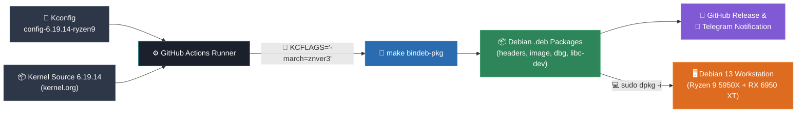

[](https://github.com/azagramac/linux-kernel/releases)

[](https://www.amd.com/es/technologies/zen-core.html#generations)
[](https://cdimage.debian.org/debian-cd/current/amd64/iso-dvd/)
[](https://gcc.gnu.org/gcc-14/)


---

Last build
---


---

## 📌 Project Architecture & CI/CD Workflow



---

## ⚡ Kernel Customization & Performance

| Subsystem | Configuration / Option | Engineering Rationale |
| :--- | :--- | :--- |
| **Target Architecture** | `-march=znver3` (`CONFIG_X86_NATIVE_CPU=y`) | Native AVX2/BMI2 instruction optimization for AMD Zen 3 microarchitecture. |
| **Scheduler & Preemption**| `PREEMPT_BUILD` / `PREEMPT=y` | Full kernel preemption for minimal input and audio processing latency. |
| **Timer Frequency** | `1000 Hz` (`CONFIG_HZ_1000=y`) | High-resolution tick frequency for desktop responsiveness and frame pacing. |
| **Tickless Kernel** | `NO_HZ_FULL=y` | Adaptive tickless kernel to eliminate periodic timer interrupts on heavy workloads. |
| **CPU Core Sizing** | `CONFIG_NR_CPUS=32` | Hardcapped to 32 threads matching Ryzen 9 5950X, eliminating virtual CPU overhead. |
| **CPU Frequency Scaling**| `amd-pstate` EPP (`CONFIG_X86_AMD_PSTATE=y`) | Hardware CPPC microsecond-level core frequency and voltage adjustments. |
| **NUMA Balancing** | `# CONFIG_NUMA_BALANCING is not set` | Disabled NUMA balancing to eliminate periodic cross-node scan overhead on 1-NUMA Ryzen CPUs. |
| **Core Scheduling** | `CONFIG_SCHED_CORE=y` | SMT thread isolation and core scheduling for security and hyperthreading performance. |
| **RCU Optimization** | `CONFIG_RCU_BOOST=y` / `CONFIG_RCU_NOCB_CPU=y` | RCU callback offloading and boosting to eliminate desktop micro-stuttering. |
| **TCP Congestion** | **TCP BBR** (`CONFIG_DEFAULT_TCP_CONG="bbr"`) | Bottleneck bandwidth RTT pacing algorithm to prevent bufferbloat and latency spikes. |
| **eBPF JIT Compiler** | `CONFIG_BPF_JIT=y` / `ALWAYS_ON` | Locked-on JIT compiler for zero-overhead packet filtering and eBPF execution. |
| **eBPF Security (LSM)** | `CONFIG_BPF_LSM=y` | In-kernel eBPF Linux Security Module for granular, high-performance security hooks. |
| **Async Socket I/O** | `IO_URING_ZCRX=y` | Zero-copy packet reception for ultra-fast network socket I/O. |
| **GPU Driver & Display** | `amdgpu` + Display Core `DCN 3.0` | Native RDNA 2 support, Resizable BAR (ReBAR), and OverDrive power limit unlocking. |
| **GPU ROCm Compute** | `CONFIG_HSA_AMD=y` / `USERPTR=y` | Native AMD KFD driver for ROCm, OpenCL 3.0, and direct GPU user-pointer memory access. |
| **PlayStation Gamepads** | `CONFIG_HID_PLAYSTATION=m` / `FF=y` | Sony DualSense (PS5) & DualShock 4 (PS4) controller support with haptic Force Feedback. |
| **Legacy Radeon Removal**| `# CONFIG_DRM_RADEON is not set` | Legacy Radeon DRM driver disabled to ensure exclusive `amdgpu` driver stack execution. |
| **AMD IOMMU Isolation** | `CONFIG_AMD_IOMMU=y` (`# INTEL_IOMMU`) | Native AMD Vi IOMMU enabled while stripping unused Intel DMAR overhead. |
| **Memory / Zswap** | `zswap` + `lzo` (`CONFIG_ZSWAP=y`) | In-RAM compressed swap cache matching kernel boot parameters (`zswap.compressor=lzo`). |
| **Hugepages & Compaction**| `THP MADVISE` + `COMPACTION=y` | Transparent Hugepages THP default set to `madvise` to avoid memory bloat with opt-in THP for games/VMs. |
| **Hung Task Diagnostics** | `CONFIG_DETECT_HUNG_TASK=y` (120s) | Automatic detection and logging of blocked or hanging kernel threads. |
| **Stack Unwinder** | `UNWINDER_ORC=y` | Low-overhead ORC call stack unwinding for precise ftrace kernel profiling. |
| **Hi-Res Audio Driver** | `snd_ca0132` (Sound Core3D) | Dedicated ALSA sound driver configured for 32-bit / 192 kHz high-resolution audio. |
| **Bloat Trimming** | Disabled unused CPU/GPU/Drivers | Removed Intel/Nvidia drivers, legacy AMD SI/CIK, and unused network vendors. |

---

## 🛠️ Custom Kernel Optimizations & Performance Features ([config-6.19.14-ryzen9](https://github.com/azagramac/linux-kernel/blob/master/configs/config-6.19.14-ryzen9))

This custom kernel build and CI/CD pipeline are specifically tuned for maximum performance, minimal latency, and zero bloat on **AMD Ryzen 9 5950X (Zen 3)** and **AMD Radeon RX 6950 XT (RDNA 2)** hardware running on Debian 13.

### 🧹 1. Hardware Trimming & Bloat Elimination
- **Non-AMD CPU Support Removed**: Disabled Intel, Hygon, Centaur, and Zhaoxin CPU support (`# CONFIG_CPU_SUP_INTEL is not set`, etc.) to streamline kernel execution paths.
- **Unused GPU Drivers Removed**: Disabled Intel i915 (`# CONFIG_DRM_I915 is not set`) and Nvidia Nouveau (`# CONFIG_DRM_NOUVEAU is not set`).
- **Legacy AMDGPU Generations Removed**: Disabled legacy Southern Islands (`SI`) and Sea Islands (`CIK`) support (`# CONFIG_DRM_AMDGPU_SI is not set`, `# CONFIG_DRM_AMDGPU_CIK is not set`), eliminating `si_support` / `cik_support` parameter warnings in `dmesg`.
- **Targeted Wireless & Network Drivers**: Kept strictly **`iwlwifi`** (Intel AX210) and **`igb`** (Intel I211), stripping unnecessary Realtek, Broadcom, Atheros, and Ralink wireless/ethernet drivers.
- **AMD IOMMU Isolation**: Native AMD Vi IOMMU driver enabled (`CONFIG_AMD_IOMMU=y`), while disabling unused Intel DMAR overhead (`# CONFIG_INTEL_IOMMU is not set`).
- **Legacy Radeon Driver Disabled**: Legacy Radeon DRM driver disabled (`# CONFIG_DRM_RADEON is not set`), ensuring exclusive `amdgpu` driver stack execution.
- **Legacy Controllers Disabled**: Removed floppy, parallel ports (`PARPORT`), PCMCIA/CardBus, FireWire (IEEE1394), ISDN, and analog modems.

### ⏱️ 2. Low-Latency Tuning (Gaming & High-Res Audio)
- **Full Preemption**: Full preemptible kernel (`CONFIG_PREEMPT_BUILD=y`, `CONFIG_PREEMPT=y`) for immediate task response and minimal audio/input latency.
- **Timer Frequency (1000 Hz)**: Set timer frequency to `1000 Hz` (`CONFIG_HZ_1000=y`, `CONFIG_HZ=1000`) for precise event timing.
- **Tickless Full (`NO_HZ_FULL`)**: Adaptive tickless kernel (`CONFIG_NO_HZ_FULL=y`) preventing periodic timer interrupts on heavy workloads and gaming threads.
- **RCU Prioritization**: RCU boosting (`CONFIG_RCU_BOOST=y`) and offloading (`CONFIG_RCU_NOCB_CPU=y`) to eliminate micro-stuttering.
- **Hi-Res Audio Driver**: Dedicated Sound Blaster Z ALSA driver (`snd_ca0132` / Sound Core3D) configured for 32-bit / 192 kHz low-jitter audio.
- **PlayStation DualSense & DualShock 4**: Dedicated Sony PlayStation HID driver (`CONFIG_HID_PLAYSTATION=m`, `CONFIG_PLAYSTATION_FF=y`) with full haptic Force Feedback for PS4/PS5 gamepads over USB and Bluetooth.

### 🧠 3. CPU Optimizations (AMD Ryzen 9 5950X — 16C / 32T)
- **Native Architecture Compilation**: Target compilation set to **Zen 3** (`-march=znver3` via `KCFLAGS="-march=znver3"`, `CONFIG_X86_NATIVE_CPU=y`).
- **Core Scheduling**: Hardware SMT core scheduling enabled (`CONFIG_SCHED_CORE=y`) for thread isolation, security, and hyperthreading gaming performance.
- **Sized Core Count**: Sized to `CONFIG_NR_CPUS=32` matching exact hardware threads, removing virtual CPU overhead.
- **AMD P-State Driver**: Native `amd-pstate` CPPC driver with EPP enabled (`CONFIG_X86_AMD_PSTATE=y`, `CONFIG_X86_AMD_PSTATE_UT=y`) for microsecond-level frequency scaling.
- **NUMA Balancing Disabled**: Disabled automatic NUMA balancing (`# CONFIG_NUMA_BALANCING is not set`) to eliminate background memory scan overhead on single-node Ryzen CPUs (`Modo(s) NUMA: 1`).

### 🎮 4. GPU & Display Core (Radeon RX 6950 XT / Navi 21)
- **Display Core (DCN 3.0)**: AMD Display Core enabled (`CONFIG_DRM_AMD_DC=y`, `CONFIG_DRM_AMD_DC_DCN=y`) optimized for Navi 21 architecture.
- **Heterogeneous Compute (ROCm / KFD)**: AMD HSA kernel driver (`CONFIG_HSA_AMD=y`) enabled for ROCm, Vulkan, and OpenCL compute.
- **Direct GPU Memory Access**: `CONFIG_DRM_AMDGPU_USERPTR=y` allowing GPU direct access to user space memory pointers.
- **Resizable BAR & OverDrive**: Full 16 GB VRAM BAR access and OverDrive power limit unlocking (`amdgpu.ppfeaturemask=0xffffffff`).

### 🌐 5. Networking & Congestion Control
- **TCP BBR Default**: Configured with **TCP BBR** as the default congestion control algorithm (`CONFIG_DEFAULT_TCP_CONG="bbr"`, `CONFIG_DEFAULT_BBR=y`). Eliminates bufferbloat and maximizes bandwidth throughput.
- **eBPF JIT & LSM**: JIT compiler enabled and locked on (`CONFIG_BPF_JIT=y`, `CONFIG_BPF_JIT_ALWAYS_ON=y`) alongside eBPF Security Module (`CONFIG_BPF_LSM=y`) for zero-overhead security hooks.
- **`IO_URING_ZCRX`**: Zero-copy network reception (`CONFIG_IO_URING_ZCRX=y`) enabled for ultra-fast socket I/O.

### 💾 6. Memory Tuning (Zswap `lzo`)
- **Zswap Storage**: Native `zswap` with `lzo` compressor (`CONFIG_ZSWAP=y`, `CONFIG_ZSWAP_COMPRESSOR_DEFAULT_LZO=y`) matching kernel boot parameters.
- **Transparent Hugepages (`madvise`)**: Set THP default to `madvise` (`CONFIG_TRANSPARENT_HUGEPAGE_MADVISE=y`) alongside memory compaction (`CONFIG_COMPACTION=y`) to prevent system-wide memory bloat while enabling 2MB hugepages for opt-in applications (games, emulators, KVM).

### 🛠️ 7. Diagnostics & CI/CD Pipeline
- **ORC Unwinder & Hung Task Detection**: ORC stack unwinder (`CONFIG_UNWINDER_ORC=y`) and automatic 120s hung task detection (`CONFIG_DETECT_HUNG_TASK=y`).
- **Scheduler & Lock Debugging**: Real-time scheduler statistics (`CONFIG_SCHEDSTATS=y`, `CONFIG_SCHED_INFO=y`) and lock debugging support (`CONFIG_LOCK_DEBUGGING_SUPPORT=y`).
- **Full Tracing Suite**: `FTRACE` infrastructure (`CONFIG_FTRACE=y`, `CONFIG_FUNCTION_TRACER=y`, `CONFIG_STACK_TRACER=y`).
- **Automated Workflow**: GitHub Actions workflow generating `.deb` packages with explicit `-march=znver3` flags and dynamic Git commit changelogs on GitHub Releases.

---

## 🔍 Post-Boot Verification & Diagnostic Commands

After booting into the custom kernel, verify active optimizations using the following commands:

- **Check Active TCP Congestion Control (BBR)**:
  ```bash
  $ sysctl net.ipv4.tcp_congestion_control
  net.ipv4.tcp_congestion_control = bbr
  ```

- **Check AMDGPU Driver & OverDrive Status**:
  ```bash
  $ sudo dmesg | grep -i amdgpu
  [    5.839374] amdgpu: Overdrive is enabled...
  [    8.098516] amdgpu 0000:0d:00.0: amdgpu: [drm] Display Core v3.2.359 initialized on DCN 3.0
  ```

- **Check AMD P-State Scaling Driver**:
  ```bash
  $ cat /sys/devices/system/cpu/cpu0/cpufreq/scaling_driver
  amd-pstate-epp
  ```

- **Check Kernel Preemption Model (Full Preempt)**:
  ```bash
  $ dmesg | grep -i "preempt"
  [    0.000000] Dynamic Preempt: full
  ```

- **Check Active Zswap Compressor**:
  ```bash
  $ cat /sys/module/zswap/parameters/enabled
  Y
  $ cat /sys/module/zswap/parameters/compressor
  lzo
  ```

- **Check eBPF JIT Compiler Status**:
  ```bash
  $ sysctl net.core.bpf_jit_enable
  net.core.bpf_jit_enable = 1
  ```

- **Check ORC Stack Unwinder Status**:
  ```bash
  $ dmesg | grep -i "ORC"
  [    0.000000] ORC unwinder alive
  ```

- **Check CPU Topology & 32-Thread Sizing**:
  ```bash
  $ lscpu | grep -E "Model name|Thread\(s\) per core|CPU\(s\):"
  CPU(s):                32
  Thread(s) per core:    2
  Model name:            AMD Ryzen 9 5950X 16-Core Processor
  ```

- **Extract Embedded Kernel Configuration from `.deb`**:
  ```bash
  $ dpkg-deb --fsys-tarfile linux-image-6.19.14-ryzen9_*.deb | tar -x ./boot/config-6.19.14-ryzen9 -O | grep -E "CONFIG_DEFAULT_TCP_CONG|CONFIG_X86_NATIVE_CPU"
  CONFIG_DEFAULT_TCP_CONG="bbr"
  CONFIG_X86_NATIVE_CPU=y
  ```

---

Hardware
-----------

### 🐧 Kernel and Toolchain
| Element             | Value               |
| ------------------- | ------------------- |
| Kernel              | Linux 6.19.14-ryzen9 |
| Model               | SMP PREEMPT_DYNAMIC |
| Base Distribution   | Debian 13           |
| Compiler            | GCC 14.2.0          |
| Target Architecture | Zen 3               |
| Grub                | `GRUB_CMDLINE_LINUX_DEFAULT="quiet amdgpu.ppfeaturemask=0xffffffff zswap.enabled=1 zswap.compressor=lzo"` |

### 🧠 CPU
| Component         | Details                                          |
| ----------------- | ------------------------------------------------ |
| Architecture      | x86_64 `amd64`                                   |
| Core Architecture | Zen 3                                            |
| CPU               | [AMD Ryzen 9 5950X](https://www.amd.com/en/products/processors/desktops/ryzen/5000-series/amd-ryzen-9-5950x.html) (Vermeer) |
| Cores / Threads   | 16 cores / 32 threads                            |
| Socket            | AM4                                              |
| Maximum Frequency | ~4.9 GHz (boost)                                 |
| TDP               | 105W                                             |
| SMT               | Enabled                                          |
| NUMA              | 1 node                                           |
| Virtualization    | AMD-V enabled                                    |
| L1 Cache          | 512 KiB (16×32 KiB data + 16×32 KiB instruction) |
| L2 Cache          | 8 MiB (16×512 KiB)                               |
| L3 Cache          | 64 MiB (2 CCDs)                                  |
| Instruction Sets  | AVX2, FMA, AES-NI, SHA-NI, VAES, BMI1/2          |

### 💾 Memory RAM
| Parameter      | Value                     |
| -------------- | ------------------------- |
| Total Capacity | 128 GB                     |
| Configuration  | 4 × 32 GB                 |
| Type           | DDR4                      |
| Speed          | 3600 MT/s                 |
| Channels       | Dual Channel              |
| ECC            | No                        |
| Model          | [G.Skill F4-3600C18-32GTZN](https://www.gskill.com/product/165/326/1562840525/F4-3600C18D-32GTZN) |

### 🎮 GPU
| Component     | Details               |
| ------------- | --------------------- |
| GPU           | [AMD Radeon RX 6950 XT](https://www.amd.com/en/products/graphics/desktops/radeon/6000-series/amd-radeon-rx-6950-xt.html) |
| Architecture  | RDNA 2 (Navi 21)      |
| PCI ID        | `1002:73a5`             |
| Kernel Driver | `amdgpu`              |
| DRM/KMS       | Enabled               |

### 🎮 GPU APIs
| API     | Version   | Device / Driver                              |
|--------|-----------|----------------------------------------------|
| AMDGPU | 3.64.0    | DRM 3.64 kernel driver for NAVI21 (6.19.14-ryzen9) |
| Vulkan | 1.4.305   | RADV (Mesa 25.0.7) for AMD Radeon RX 6950 XT |
| OpenCL | 3.0       | OpenCL C 1.2 via ROCr / RustiCL / Mesa       |
| OpenGL | 4.6       | Mesa 25.0.7 (Compatibility Profile, LLVM 19.1.7) |
| BAR    | Enabled   | *Runtime Detection*: `VRAM RAM=16368M, BAR=16384M (Resizable BAR Enabled)`|

### 🧩 Motherboard
| Component    | Details                              |
| ------------ | ------------------------------------ |
| Motherboard  | [Gigabyte X570 AORUS ELITE](https://www.gigabyte.com/Motherboard/X570-AORUS-ELITE-rev-10/sp) (rev. 1.0) |
| Chipset      | AMD X570                             |
| Manufacturer | Gigabyte Technology Co., Ltd.        |
| BIOS         | AMI (American Megatrends)            |
| BIOS Version | [F40](https://www.gigabyte.com/latam/Motherboard/X570-AORUS-ELITE-rev-10/support#Support-Bios)                                  |
| BIOS Date    | 2025-10-29                           |
| Boot Mode    | UEFI                                 |
| SMBIOS       | 3.3.0                                |
| AMD AGESA       | 1.2.0.F                                |

### 🔐 Trusted Platform Module (TPM)
| Parameter         | Value                         |
| ----------------- | ----------------------------- |
| Type              | fTPM (Firmware TPM)           |
| Version           | TPM 2.0                       |
| Manufacturer      | AMD                           |
| Implementation    | AMD CPU fTPM                  |
| Interface         | CRB (Command Response Buffer) |
| ACPI              | TPM2 table present            |
| Device            | `/dev/tpm0`, `/dev/tpmrm0`    |
| Permissions       | `tss` group                   |
| Kernel Driver     | `tpm_crb` (built-in)          |
| Status            | Enabled in UEFI               |
| Compliance        | FIPS 140-2                    |
| TPM Revision      | 1.38                          |
| PCRs              | 24                            |
| Input Buffer      | 1024 bytes                    |
| Max Command Size  | 4096 bytes                    |
| Max Response Size | 4096 bytes                    |
| Hardware RNG      | Disabled (CRB design)         |

### 🔊 Audio
| Component  | Details                  |
| ---------- | ------------------------ |
| Sound Card | [Creative Sound Blaster Z](https://es.creative.com/p/sound-blaster/sound-blaster-z-se) |
| Chip       | CA0132 Sound Core3D      |
| PCI ID     | `1102:0012`                |
| Driver     | ALSA (`snd_ca0132`)      |
| Hi-res Audio | [Enabled](https://blog.azagra.dev/linux/high-res-audio-192-khz-en-debian-13-sound-blaster-z) `32 bits / 192kHz` |
| Speakers     | [Edifier M90](https://link.amazon/B04QwlNPx)       |

### 🌐 Network — Ethernet
| Component  | Details            |
| ---------- | ------------------ |
| Controller | [Intel I211 Gigabit](https://www.intel.la/content/www/xl/es/content-details/333015/intel-ethernet-controller-i211-specification-update.html) |
| PCI ID     | `8086:1539`          |
| Driver     | `igb`              |

### 📡 Wi-Fi / Bluetooth
| Component | Details                                     |
| --------- | ------------------------------------------- |
| Wi-Fi     | [Intel AX210](https://www.intel.com/content/www/us/en/products/sku/204836/intel-wifi-6e-ax210-gig/specifications.html)                                 |
| Standard  | Wi-Fi 6E (802.11ax)                         |
| PCI ID    | `8086:2725`                                 |
| Driver    | `iwlwifi`                                   |
| Bluetooth | 5.3                                         |
| USB ID    | `8087:0032`                                 |
| Driver    | `btusb` + `btintel` (kernel modules loaded) |

---

 Linux kernel
============

The Linux kernel is the core of any Linux operating system. It manages hardware,
system resources, and provides the fundamental services for all other software.

Quick Start
-----------

* Report a bug: See Documentation/admin-guide/reporting-issues.rst
* Get the latest kernel: https://kernel.org
* Build the kernel: See Documentation/admin-guide/quickly-build-trimmed-linux.rst
* Join the community: https://lore.kernel.org/

Essential Documentation
-----------------------

All users should be familiar with:

* Building requirements: Documentation/process/changes.rst
* Code of Conduct: Documentation/process/code-of-conduct.rst
* License: See COPYING

Documentation can be built with make htmldocs or viewed online at:
https://www.kernel.org/doc/html/latest/


Who Are You?
============

Find your role below:

* New Kernel Developer - Getting started with kernel development
* Academic Researcher - Studying kernel internals and architecture
* Security Expert - Hardening and vulnerability analysis
* Backport/Maintenance Engineer - Maintaining stable kernels
* System Administrator - Configuring and troubleshooting
* Maintainer - Leading subsystems and reviewing patches
* Hardware Vendor - Writing drivers for new hardware
* Distribution Maintainer - Packaging kernels for distros
