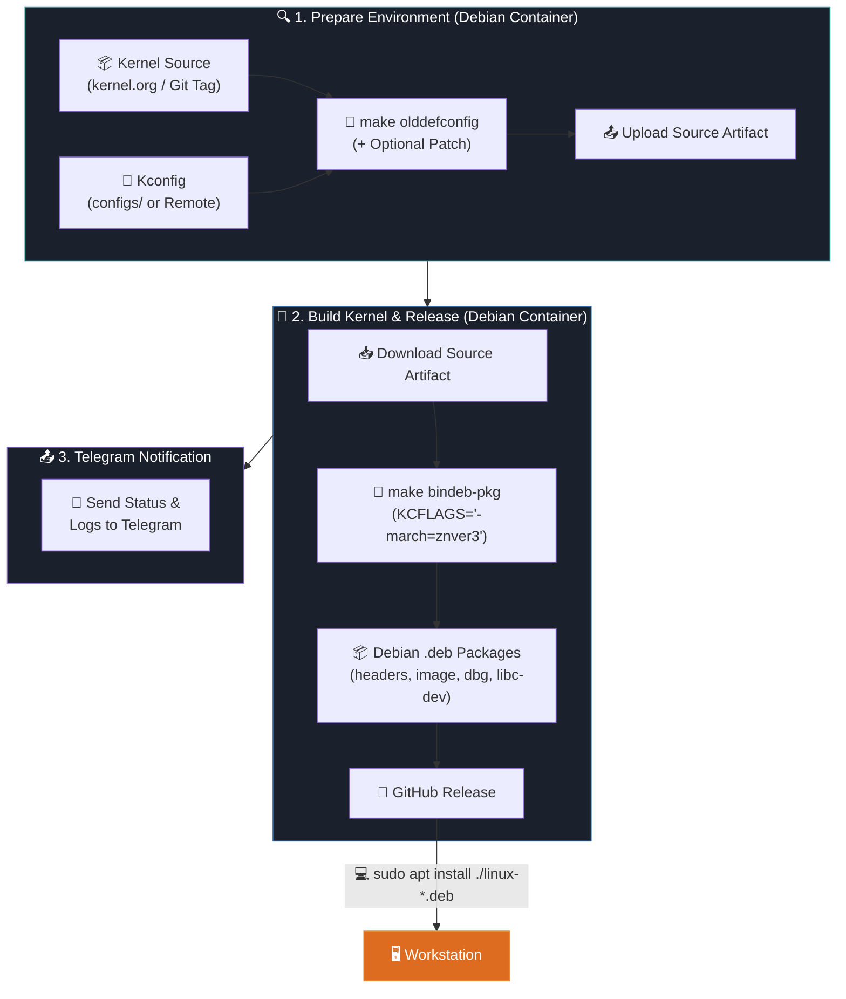

 Linux kernel
============

The Linux kernel is the core of any Linux operating system. It manages hardware,
system resources, and provides the fundamental services for all other software.

-----------


[](https://github.com/azagramac/linux-kernel/releases)

[](https://www.amd.com/es/technologies/zen-core.html#generations)
[](https://cdimage.debian.org/debian-cd/current/amd64/iso-dvd/)
[](https://gcc.gnu.org/gcc-14/)

---

## Last build


---

## 📌 Project Architecture & CI/CD Workflow


```mermaid
graph TD
    subgraph Job1["🔍 1. Prepare Environment (Debian Container)"]
        A1["📦 Kernel Source<br/>(kernel.org / Git Tag)"] --> A3["🔧 make olddefconfig<br/>(+ Optional Patch)"]
        A2["📄 Kconfig<br/>(configs/ or Remote)"] --> A3
        A3 --> A4["📤 Upload Source Artifact"]
    end

    subgraph Job2["🐧 2. Build Kernel & Release (Debian Container)"]
        B1["📥 Download Source Artifact"] --> B2["🐧 make bindeb-pkg<br/>(KCFLAGS='-march=znver3')"]
        B2 --> B3["📦 Debian .deb Packages<br/>(headers, image, dbg, libc-dev)"]
        B3 --> B4["🚀 GitHub Release"]
    end

    subgraph Job3["📤 3. Telegram Notification"]
        C1["📲 Send Status &<br/>Logs to Telegram"]
    end

    Job1 --> Job2
    Job2 --> Job3
    B4 -->|"💻 sudo apt install ./linux-*.deb"| D["🖥️ Workstation<br/>"]

    style Job1 fill:#1a202c,stroke:#319795,color:#fff
    style Job2 fill:#1a202c,stroke:#2b6cb0,color:#fff
    style Job3 fill:#1a202c,stroke:#805ad5,color:#fff
    style D fill:#dd6b20,stroke:#ed8936,color:#fff
```
---

## ⚡ Kernel Customization & Performance

| Subsystem | Configuration / Option | Engineering Rationale |
| :--- | :--- | :--- |
| **Native CPU Optimization** | `CONFIG_X86_NATIVE_CPU=y` + `KCFLAGS="-march=znver3"` | Two-layer native optimization: `X86_NATIVE_CPU` enables Kconfig CPU feature selection based on the build host ISA; `-march=znver3` directs GCC to emit Zen 3-specific instructions (AVX2/BMI2/VAES). Both are complementary and required for full native optimization. |
| **Scheduler & Preemption**| `PREEMPT_BUILD` / `PREEMPT=y` | Full kernel preemption for minimal input and audio processing latency. |
| **Timer Frequency** | `1000 Hz` (`CONFIG_HZ_1000=y`) | High-resolution tick frequency for desktop responsiveness and frame pacing. |
| **Tickless Kernel** | `CONFIG_NO_HZ_IDLE=y` | Idle-tickless kernel: timer interrupts suppressed on idle CPUs, reducing power and wakeup overhead. `NO_HZ_FULL` is intentionally not enabled to avoid scheduler complexity. |
| **CPU Core Sizing** | `CONFIG_NR_CPUS=32` | Hardcapped to 32 threads matching Ryzen 9 5950X, eliminating virtual CPU overhead. |
| **CPU Frequency Scaling**| `amd-pstate` EPP (`CONFIG_X86_AMD_PSTATE=y`) | Hardware CPPC microsecond-level core frequency and voltage adjustments. |
| **NUMA** | `CONFIG_NUMA=y` / `# CONFIG_NUMA_BALANCING is not set` | NUMA infrastructure retained (`CONFIG_AMD_NUMA=y`, `CONFIG_X86_64_ACPI_NUMA=y`); automatic NUMA memory balancing disabled to eliminate background scan overhead on this single-node Ryzen system. |
| **Core Scheduling** | `CONFIG_SCHED_CORE=y` | SMT thread isolation and core scheduling for security and hyperthreading performance. |
| **TCP Congestion** | **TCP BBR** (`CONFIG_DEFAULT_TCP_CONG="bbr"`) | Bottleneck bandwidth RTT pacing algorithm to prevent bufferbloat and latency spikes. |
| **Extensible Scheduler** | `CONFIG_SCHED_CLASS_EXT=y` | In-kernel `sched-ext` BPF scheduler class. Enables the mechanism for dynamically loading external BPF schedulers (`scx_bpfland`, `scx_rusty`) at runtime — they are **not** embedded in the kernel. Depends on BPF infrastructure (`CONFIG_BPF=y`, `CONFIG_BPF_SYSCALL=y`). |
| **Extended Group Sched** | `CONFIG_EXT_GROUP_SCHED=y` | Extended group scheduling infrastructure used by `sched-ext` and cgroup-aware scheduling policies (`CGROUP_BPF`, `CGROUP_SCHED`). |
| **VRAM Cgroup Management** | `CONFIG_CGROUP_DMEM=y` | Device Memory cgroup controller enabling dynamic VRAM resource allocation and priority control on `amdgpu`. |
| **eBPF JIT Compiler** | `CONFIG_BPF_JIT=y` / `CONFIG_BPF_JIT_DEFAULT_ON=y` | JIT compiler enabled and active by default; `BPF_JIT_ALWAYS_ON` is intentionally not set, preserving runtime control via `net.core.bpf_jit_enable`. |
| **eBPF Security (LSM)** | `CONFIG_BPF_LSM=y` | In-kernel eBPF Linux Security Module for granular, high-performance security hooks. |
| **eBPF BTF Type Format** | `CONFIG_DEBUG_INFO_BTF=y` | Pahole split-BTF typeinfo generation for vmlinux and modules (`BTF_MODULES=y`) for eBPF tracing tools. |
| **Async Socket I/O** | `IO_URING_ZCRX=y` | Zero-copy packet reception for ultra-fast network socket I/O. |
| **GPU Driver** | `CONFIG_DRM_AMDGPU=m` | AMDGPU as loadable kernel module (not built-in). SI/CIK legacy support disabled. Native RDNA 2 support, Resizable BAR (ReBAR), and OverDrive power limit unlocking. |
| **AMD Display Core** | `CONFIG_DRM_AMD_DC=y` / `CONFIG_DRM_AMD_DC_FP=y` | AMD Display Core with fast-path support for DCN 3.0 (Navi 21 / RX 6950 XT). |
| **AMD Secure Display** | `CONFIG_DRM_AMD_SECURE_DISPLAY=y` | Secure display path support for AMD GPU. |
| **AMD Audio Coprocessor** | `CONFIG_DRM_AMD_ACP=y` | AMD Audio CoProcessor driver enabled alongside AMDGPU. |
| **GPU ROCm Compute** | `CONFIG_HSA_AMD=y` / `CONFIG_DRM_AMDGPU_USERPTR=y` | Native AMD KFD driver for ROCm, OpenCL 3.0, and direct GPU user-pointer memory access. |
| **PlayStation Gamepads** | `CONFIG_HID_PLAYSTATION=m` / `FF=y` | Sony DualSense (PS5) & DualShock 4 (PS4) controller support with haptic Force Feedback. |
| **Legacy Radeon Removal**| `# CONFIG_DRM_RADEON is not set` | Legacy Radeon DRM driver disabled to ensure exclusive `amdgpu` driver stack execution. |
| **AMD IOMMU Isolation** | `CONFIG_AMD_IOMMU=y` (`# INTEL_IOMMU`) | Native AMD Vi IOMMU enabled while stripping unused Intel DMAR overhead. |
| **Memory / Zswap** | `zswap` + `lzo` (`CONFIG_ZSWAP=y`) | In-RAM compressed swap cache matching kernel boot parameters (`zswap.compressor=lzo`). |
| **Hugepages & Compaction**| `THP MADVISE` + `COMPACTION=y` | Transparent Hugepages THP default set to `madvise` to avoid memory bloat with opt-in THP for games/VMs. |
| **Hung Task Diagnostics** | `CONFIG_DETECT_HUNG_TASK=y` (120s) | Automatic detection and logging of blocked or hanging kernel threads. |
| **Stack Unwinder** | `UNWINDER_ORC=y` | Low-overhead ORC call stack unwinding for precise ftrace kernel profiling. |
| **Hi-Res Audio Driver** | `CONFIG_SND_HDA_CODEC_CA0132=m` | CA0132 Sound Core3D HDA codec as loadable module, with DSP firmware support (`CA0132_DSP=y`) for Sound Blaster Z 32-bit / 192 kHz audio. |
| **CPU Mitigations** | `CONFIG_CPU_MITIGATIONS=y` | Full Spectre/Meltdown/RetBleed/SRSO/SSB/TSA mitigation suite retained — this is not a "performance at all costs" kernel. |
| **CET / IBT** | `CONFIG_X86_CET=y` / `CONFIG_X86_KERNEL_IBT=y` | Hardware Indirect Branch Tracking for kernel control-flow integrity (supported on Zen 3). |
| **User Shadow Stack** | `CONFIG_X86_USER_SHADOW_STACK=y` | CET Shadow Stack for user-space return address protection. |
| **Bloat Trimming** | Disabled unused CPU/GPU/Drivers | Removed Intel/Nvidia drivers, legacy AMD SI/CIK, and unused network vendors. |

---

## 🛠️ Custom Kernel Optimizations & Performance Features

This custom kernel build and CI/CD pipeline are specifically tuned for **this exact hardware**: AMD Ryzen 9 5950X (Zen 3) and AMD Radeon RX 6950 XT (RDNA 2) running on Debian 13.

The guiding philosophy is **hardware/driver bloat removal while retaining security and diagnostic capabilities**:
- 🔧 CPU-specific optimization (Zen 3, 32 threads, AMD pstate, PREEMPT, 1000 Hz)
- 🎮 GPU-specific support (RDNA 2 / amdgpu module, ROCm, VRAM cgroups)
- 🌐 Targeted network drivers only (I211 + AX210)
- 🔐 Security retained (all CPU mitigations, CET/IBT, BPF LSM)
- 🔍 Diagnostics retained (BTF, Ftrace, Kprobes, ORC)
- 🗑️ Hardware bloat removed (Intel GPU, NVIDIA, legacy Radeon, unused network, legacy buses)

### 🧹 1. Hardware Trimming & Bloat Elimination
- **Non-AMD CPU Support Removed**: Disabled Intel, Hygon, Centaur, and Zhaoxin CPU support (`# CONFIG_CPU_SUP_INTEL is not set`, etc.) to streamline kernel execution paths.
- **Unused GPU Drivers Removed**: Disabled Intel i915 (`# CONFIG_DRM_I915 is not set`) and Nvidia Nouveau (`# CONFIG_DRM_NOUVEAU is not set`).
- **Legacy AMDGPU Generations Removed**: Disabled legacy Southern Islands (`SI`) and Sea Islands (`CIK`) support (`# CONFIG_DRM_AMDGPU_SI is not set`, `# CONFIG_DRM_AMDGPU_CIK is not set`), eliminating `si_support` / `cik_support` parameter warnings in `dmesg`.
- **Targeted Wireless & Network Drivers**: Kept strictly **`iwlwifi`** (Intel AX210) and **`igb`** (Intel I211), stripping unnecessary Realtek, Broadcom, Atheros, and Ralink wireless/ethernet drivers.
- **AMD IOMMU Isolation**: Native AMD Vi IOMMU driver enabled (`CONFIG_AMD_IOMMU=y`), while disabling unused Intel DMAR overhead (`# CONFIG_INTEL_IOMMU is not set`).
- **Legacy Radeon Driver Disabled**: Legacy Radeon DRM driver disabled (`# CONFIG_DRM_RADEON is not set`), ensuring exclusive `amdgpu` driver stack execution.
- **Legacy Controllers Disabled**: Removed floppy, parallel ports (`PARPORT`), PCMCIA/CardBus, FireWire (IEEE1394), ISDN, and analog modems.
- **DVB & TV Capture Removal**: Disabled DVB digital/analog TV, SDR radio, and PCI capture cards (`# CONFIG_DVB_CORE is not set`, `# CONFIG_MEDIA_PCI_SUPPORT is not set`), while preserving USB webcam support (`CONFIG_USB_VIDEO_CLASS=m`).

### ⏱️ 2. Low-Latency Tuning (Gaming & High-Res Audio)
- **Full Preemption**: Full preemptible kernel (`CONFIG_PREEMPT_BUILD=y`, `CONFIG_PREEMPT=y`) for immediate task response and minimal audio/input latency.
- **Timer Frequency (1000 Hz)**: Set timer frequency to `1000 Hz` (`CONFIG_HZ_1000=y`, `CONFIG_HZ=1000`) for precise event timing.
- **Tickless Idle (`NO_HZ_IDLE`)**: Idle-tickless kernel (`CONFIG_NO_HZ_IDLE=y`) suppressing timer interrupts on idle CPUs, reducing wakeup overhead. Full tickless mode (`NO_HZ_FULL`) is intentionally not enabled to avoid scheduler complexity on this configuration.
- **Hi-Res Audio Driver**: Dedicated Sound Blaster Z ALSA driver (`snd_ca0132` / Sound Core3D) configured for 32-bit / 192 kHz low-jitter audio.
- **PlayStation DualSense & DualShock 4**: Dedicated Sony PlayStation HID driver (`CONFIG_HID_PLAYSTATION=m`, `CONFIG_PLAYSTATION_FF=y`) with full haptic Force Feedback for PS4/PS5 gamepads over USB and Bluetooth.

### 🧠 3. CPU Optimizations (AMD Ryzen 9 5950X — 16C / 32T)
- **Native Architecture Compilation — two-layer optimization**:
  - `CONFIG_X86_NATIVE_CPU=y` — instructs Kconfig to probe the build host CPU and enable matching kernel features (e.g., VAES, AVX2 crypto paths, AMD-specific code paths).
  - `KCFLAGS="-march=znver3"` — instructs GCC to emit Zen 3-specific instructions throughout the build. Set in the CI workflow (`make bindeb-pkg KCFLAGS="-march=znver3"`).
  - Both flags are complementary and required for full native optimization; neither alone is sufficient.
- **Core Scheduling**: Hardware SMT core scheduling enabled (`CONFIG_SCHED_CORE=y`) for thread isolation, security, and hyperthreading gaming performance.
- **Sized Core Count**: Sized to `CONFIG_NR_CPUS=32` matching exact hardware threads, removing virtual CPU overhead.
- **AMD P-State Driver**: Native `amd-pstate` CPPC driver with EPP enabled (`CONFIG_X86_AMD_PSTATE=y`, `CONFIG_X86_AMD_PSTATE_UT=y`) for microsecond-level frequency scaling.
- **NUMA Infrastructure**: NUMA support is retained (`CONFIG_NUMA=y`, `CONFIG_AMD_NUMA=y`, `CONFIG_X86_64_ACPI_NUMA=y`) for correct hardware topology detection. Automatic NUMA balancing (`# CONFIG_NUMA_BALANCING is not set`) is disabled to eliminate background memory scan overhead on this single-node Ryzen system.
- **eBPF Extensible Scheduler (`sched-ext`)**: Enabled in-kernel eBPF scheduler class (`CONFIG_SCHED_CLASS_EXT=y`). This exposes the `sched-ext` API that relies on the kernel BPF infrastructure (`CONFIG_BPF=y`, `CONFIG_BPF_SYSCALL=y`, `CONFIG_BPF_JIT=y`). External schedulers like `scx_bpfland` or `scx_rusty` can be loaded at runtime via userspace tools — they are **not** part of this kernel build.
- **Extended Group Scheduling**: `CONFIG_EXT_GROUP_SCHED=y` enables the extended group scheduling infrastructure used by `sched-ext` and cgroup-aware scheduling policies.

### 🎮 4. GPU & Display Core (Radeon RX 6950 XT / Navi 21)
- **AMDGPU as Module**: `CONFIG_DRM_AMDGPU=m` — the AMDGPU driver is a loadable kernel module, not built into the kernel image. This is the standard Debian/upstream configuration for GPU drivers.
- **Display Core (DCN 3.0)**: AMD Display Core enabled (`CONFIG_DRM_AMD_DC=y`) with fast-path support (`CONFIG_DRM_AMD_DC_FP=y`), optimized for Navi 21 / RDNA 2 architecture (DCN 3.0).
- **Additional AMDGPU features**: Audio CoProcessor (`CONFIG_DRM_AMD_ACP=y`), Secure Display (`CONFIG_DRM_AMD_SECURE_DISPLAY=y`), and ISP support (`CONFIG_DRM_AMD_ISP=y`) enabled.
- **Heterogeneous Compute (ROCm / KFD)**: AMD HSA kernel driver (`CONFIG_HSA_AMD=y`) enabled for ROCm, Vulkan, and OpenCL compute.
- **Direct GPU Memory Access**: `CONFIG_DRM_AMDGPU_USERPTR=y` allowing GPU direct access to user space memory pointers.
- **Resizable BAR & OverDrive**: Full 16 GB VRAM BAR access and OverDrive power limit unlocking (`amdgpu.ppfeaturemask=0xffffffff`).
- **VRAM Cgroup Management (`CONFIG_CGROUP_DMEM=y`)**: Enabled cgroups v2 Device Memory controller for `amdgpu`, allowing dynamic VRAM priority allocation (`dmemcg-booster`) to eliminate stutter under heavy VRAM pressure.

### 🌐 5. Networking & Congestion Control
- **TCP BBR Default**: Configured with **TCP BBR** as the default congestion control algorithm (`CONFIG_DEFAULT_TCP_CONG="bbr"`, `CONFIG_DEFAULT_BBR=y`). Eliminates bufferbloat and maximizes bandwidth throughput.
- **eBPF JIT & LSM**: JIT compiler enabled and active by default (`CONFIG_BPF_JIT=y`, `CONFIG_BPF_JIT_DEFAULT_ON=y`) alongside eBPF Security Module (`CONFIG_BPF_LSM=y`) for zero-overhead security hooks. `BPF_JIT_ALWAYS_ON` is intentionally not set, preserving runtime control via `net.core.bpf_jit_enable`.
- **`IO_URING_ZCRX`**: Zero-copy network reception (`CONFIG_IO_URING_ZCRX=y`) enabled for ultra-fast socket I/O.

### 💾 6. Memory Tuning (Zswap `lzo`)
- **Zswap Storage**: Native `zswap` with `lzo` compressor (`CONFIG_ZSWAP=y`, `CONFIG_ZSWAP_COMPRESSOR_DEFAULT_LZO=y`) matching kernel boot parameters.
- **Transparent Hugepages (`madvise`)**: Set THP default to `madvise` (`CONFIG_TRANSPARENT_HUGEPAGE_MADVISE=y`) alongside memory compaction (`CONFIG_COMPACTION=y`) to prevent system-wide memory bloat while enabling 2MB hugepages for opt-in applications (games, emulators, KVM).

### 🛠️ 7. Diagnostics & Tracing Infrastructure

> `CONFIG_DEBUG_KERNEL=y` is set intentionally. This enables the diagnostic/tracing infrastructure **without** heavyweight runtime overhead — KASAN, KFENCE, SLUB_DEBUG, DEBUG_VM, and lock validators are **not** set.

- **ORC Unwinder & Hung Task Detection**: ORC stack unwinder (`CONFIG_UNWINDER_ORC=y`) and automatic 120s hung task detection (`CONFIG_DETECT_HUNG_TASK=y`).
- **Scheduler Statistics**: Real-time scheduler statistics (`CONFIG_SCHEDSTATS=y`, `CONFIG_SCHED_INFO=y`) for performance profiling and `perf sched` analysis.
- **Full Ftrace Suite**: Complete function tracing infrastructure (`CONFIG_FTRACE=y`, `CONFIG_FUNCTION_TRACER=y`, `CONFIG_FUNCTION_GRAPH_TRACER=y`, `CONFIG_DYNAMIC_FTRACE=y`, `CONFIG_STACK_TRACER=y`).
- **Kernel Probes**: `CONFIG_KPROBE_EVENTS=y`, `CONFIG_UPROBE_EVENTS=y`, `CONFIG_BPF_EVENTS=y` — enabling `perf`, `bpftrace`, and eBPF-based tracing tools.
- **BTF Type Information**: `CONFIG_DEBUG_INFO_BTF=y` and `CONFIG_DEBUG_INFO_BTF_MODULES=y` — required for CO-RE eBPF programs and tools like `bpftool` and `bpftrace`.
- **Block I/O Tracing**: `CONFIG_BLK_DEV_IO_TRACE=y` for `blktrace`/`blkparse` disk I/O analysis.
- **Automated Workflow**: GitHub Actions workflow generating `.deb` packages with explicit `-march=znver3` flags and dynamic Git commit changelogs on GitHub Releases.

### 🔐 8. CPU Security & Mitigations (Zen 3 / x86_64)

This kernel is **not** a "performance at all costs" build — all CPU security mitigations are retained:

- **CPU Mitigations Enabled**: Full mitigation suite active (`CONFIG_CPU_MITIGATIONS=y`), including Spectre v1/v2, Retpoline, SRSO (AMD-specific Zen), SSB, RetBleed, IBPB entry, SLS, and TSA.
- **Page Table Isolation**: KPTI enabled (`CONFIG_MITIGATION_PAGE_TABLE_ISOLATION=y`) for Meltdown protection.
- **AMD SRSO Mitigation**: Speculative Return Stack Overflow mitigation (`CONFIG_MITIGATION_SRSO=y`) — directly relevant for Zen 3 microarchitecture.
- **Control Flow Integrity (CET/IBT)**: Hardware-enforced Indirect Branch Tracking enabled (`CONFIG_X86_CET=y`, `CONFIG_X86_KERNEL_IBT=y`) for kernel control-flow integrity.
- **User Shadow Stack**: CET Shadow Stack for user-space enabled (`CONFIG_X86_USER_SHADOW_STACK=y`) for return address protection.

The security philosophy is **hardware/driver bloat removal** — not security regression.

---

### 🔬 9. Diagnostics, Tracing & Observability

The kernel deliberately retains a comprehensive diagnostic and tracing stack.

This is **intentional**: the project removes unnecessary runtime hardware support, while keeping the infrastructure needed to diagnose and profile the system.

#### 🔍 Kernel Debug Infrastructure

```
CONFIG_DEBUG_KERNEL=y
CONFIG_DEBUG_MISC=y
CONFIG_DEBUG_INFO=y
CONFIG_DEBUG_INFO_BTF=y
CONFIG_DEBUG_INFO_BTF_MODULES=y
CONFIG_DYNAMIC_DEBUG=y
CONFIG_DYNAMIC_DEBUG_CORE=y
```

#### 📊 Scheduler Diagnostics

```
CONFIG_SCHED_INFO=y
CONFIG_SCHEDSTATS=y
CONFIG_LOCK_DEBUGGING_SUPPORT=y
```

Heavy lock validation facilities are disabled:

```
# CONFIG_PROVE_LOCKING is not set
# CONFIG_LOCK_STAT is not set
# CONFIG_DEBUG_SPINLOCK is not set
# CONFIG_DEBUG_MUTEXES is not set
# CONFIG_DEBUG_ATOMIC_SLEEP is not set
```

This provides scheduler/diagnostic visibility without enabling the heavier debugging stack.

#### 🔎 Ftrace

The kernel retains a full Ftrace suite:

```
CONFIG_FTRACE=y
CONFIG_FUNCTION_TRACER=y
CONFIG_FUNCTION_GRAPH_TRACER=y
CONFIG_DYNAMIC_FTRACE=y
CONFIG_DYNAMIC_FTRACE_WITH_REGS=y
CONFIG_DYNAMIC_FTRACE_WITH_DIRECT_CALLS=y
CONFIG_DYNAMIC_FTRACE_WITH_ARGS=y
CONFIG_STACK_TRACER=y
CONFIG_FTRACE_SYSCALLS=y
CONFIG_KPROBE_EVENTS=y
CONFIG_UPROBE_EVENTS=y
CONFIG_BPF_EVENTS=y
CONFIG_DYNAMIC_EVENTS=y
```

This enables advanced runtime tracing and profiling with tools like `ftrace`, `perf`, `bpftrace`, and `trace-cmd`.

#### 🧭 ORC Unwinder

```
CONFIG_UNWINDER_ORC=y
# CONFIG_UNWINDER_FRAME_POINTER is not set
```

The ORC unwinder provides efficient and accurate kernel stack unwinding for `perf` and `ftrace` call stacks.

#### 🚨 Hung Task / Lockup Detection

```
CONFIG_LOCKUP_DETECTOR=y
CONFIG_SOFTLOCKUP_DETECTOR=y
CONFIG_HARDLOCKUP_DETECTOR=y
CONFIG_DETECT_HUNG_TASK=y
CONFIG_DEFAULT_HUNG_TASK_TIMEOUT=120
```

The kernel detects:
- soft lockups (NMI watchdog)
- hard lockups (perf-based `HARDLOCKUP_DETECTOR_PERF`)
- hung tasks (120 second default timeout)

---

## 🔍 14. Post-Boot Verification

After booting into the custom kernel, verify active optimizations using the following commands.

#### Kernel version
```bash
$ uname -a
Linux debian 7.2.8-ryzen9 #ryzen9 SMP PREEMPT_DYNAMIC Tue Sep 29 23:45:16 CEST 2026 x86_64 GNU/Linux
```

#### CPU topology
```bash
$ lscpu | grep -E "Model name|Thread\(s\) per core|CPU\(s\):"
CPU(s):                32
Thread(s) per core:    2
Model name:            AMD Ryzen 9 5950X 16-Core Processor
```

#### AMD P-State
```bash
$ cat /sys/devices/system/cpu/cpu0/cpufreq/scaling_driver
amd-pstate-epp
```

#### Preemption
```bash
$ sudo dmesg | grep -i "preempt"
[    0.032333] Dynamic Preempt: full
[    0.032388] rcu: Preemptible hierarchical RCU implementation.
```
> `CONFIG_PREEMPT_BUILD=y`, `CONFIG_PREEMPT=y`, `CONFIG_PREEMPT_DYNAMIC=y`

#### NO_HZ
```bash
$ grep -E "CONFIG_NO_HZ_(IDLE|FULL)" /boot/config-$(uname -r)
CONFIG_NO_HZ_IDLE=y
# CONFIG_NO_HZ_FULL is not set
```

#### RCU
```bash
$ grep -E "CONFIG_RCU_(BOOST|NOCB_CPU)" /boot/config-$(uname -r)
```
No output expected — `RCU_BOOST` and `RCU_NOCB_CPU` are not set in this configuration.

#### TCP BBR
```bash
$ sysctl net.ipv4.tcp_congestion_control
net.ipv4.tcp_congestion_control = bbr
```

#### Zswap
```bash
$ cat /sys/module/zswap/parameters/enabled
Y
$ cat /sys/module/zswap/parameters/compressor
lzo
```

#### AMDGPU
```bash
$ sudo dmesg | grep -i amdgpu | head -30
[    0.000000] Command line: BOOT_IMAGE=/vmlinuz-7.2.8-ryzen9 root=UUID=b6580fbd-f315-4df0-b934-da60ed1467e3 ro amdgpu.ppfeaturemask=0xffffffff zswap.enabled=1 zswap.compressor=lzo
[    0.009148] Kernel command line: BOOT_IMAGE=/vmlinuz-7.2.8-ryzen9 root=UUID=b6580fbd-f315-4df0-b934-da60ed1467e3 ro amdgpu.ppfeaturemask=0xffffffff zswap.enabled=1 zswap.compressor=lzo
[    4.859534] amdgpu: unknown parameter 'si_support' ignored
[    4.860323] amdgpu: unknown parameter 'cik_support' ignored
[    4.866799] amdgpu: Virtual CRAT table created for CPU
[    4.867606] amdgpu: Topology: Add CPU node
[    4.868422] amdgpu: Overdrive is enabled, please disable it before reporting any bugs unrelated to overdrive.
[    4.869268] amdgpu 0000:0d:00.0: enabling device (0006 -> 0007)
[    4.870087] amdgpu 0000:0d:00.0: initializing kernel modesetting (SIENNA_CICHLID 0x1002:0x73A5 0x1002:0x0E3A 0xC0).
[    4.870907] amdgpu 0000:0d:00.0: register mmio base: 0xFC900000
[    4.871664] amdgpu 0000:0d:00.0: register mmio size: 1048576
[    4.876104] amdgpu 0000:0d:00.0: detected ip block number 0 <common_v1_0_0> (nv_common)
[    4.876820] amdgpu 0000:0d:00.0: detected ip block number 1 <gmc_v10_0_0> (gmc_v10_0)
[    4.877510] amdgpu 0000:0d:00.0: detected ip block number 2 <ih_v5_0_0> (navi10_ih)
[    4.878172] amdgpu 0000:0d:00.0: detected ip block number 3 <psp_v11_0_0> (psp)
[    4.878825] amdgpu 0000:0d:00.0: detected ip block number 4 <smu_v11_0_0> (smu)
[    4.879470] amdgpu 0000:0d:00.0: detected ip block number 5 <dce_v1_0_0> (dm)
[    4.880098] amdgpu 0000:0d:00.0: detected ip block number 6 <gfx_v10_0_0> (gfx_v10_0)
[    4.880712] amdgpu 0000:0d:00.0: detected ip block number 7 <sdma_v5_2_0> (sdma_v5_2)
[    4.881301] amdgpu 0000:0d:00.0: detected ip block number 8 <vcn_v3_0_0> (vcn_v3_0)
[    4.881866] amdgpu 0000:0d:00.0: detected ip block number 9 <jpeg_v3_0_0> (jpeg_v3_0)
[    4.882420] amdgpu 0000:0d:00.0: Fetched VBIOS from VFCT
[    4.882943] amdgpu 0000:0d:00.0: [drm] ATOM BIOS: 113-D4124100-102, build: 604554  , ver: 020.001.000.071.018202, 2022/03/10
[    4.885161] amdgpu 0000:0d:00.0: vgaarb: deactivate vga console
[    4.885165] amdgpu 0000:0d:00.0: Trusted Memory Zone (TMZ) feature disabled as experimental (default)
[    4.885199] amdgpu 0000:0d:00.0: MEM ECC is not presented.
[    4.885205] amdgpu 0000:0d:00.0: SRAM ECC is not presented.
[    4.885215] amdgpu 0000:0d:00.0: vm size is 262144 GB, 4 levels, block size is 9-bit, fragment size is 9-bit
[    4.885226] amdgpu 0000:0d:00.0: VRAM: 16368M 0x0000008000000000 - 0x00000083FEFFFFFF (16368M used)
[    4.885232] amdgpu 0000:0d:00.0: GART: 512M 0x0000000000000000 - 0x000000001FFFFFFF
```
> The `si_support`/`cik_support` "ignored" warnings confirm that legacy SI/CIK support is correctly disabled in the config (`# CONFIG_DRM_AMDGPU_SI is not set`). VRAM: **16368M** with full ReBAR mapping.

#### Device Memory Cgroup
```bash
$ grep CONFIG_CGROUP_DMEM /boot/config-$(uname -r)
CONFIG_CGROUP_DMEM=y
```

#### BPF JIT
```bash
$ grep -E "CONFIG_BPF_JIT" /boot/config-$(uname -r)
CONFIG_BPF_JIT=y
CONFIG_BPF_JIT_DEFAULT_ON=y
# CONFIG_BPF_JIT_ALWAYS_ON is not set
```

#### sched-ext
```bash
$ cat /sys/kernel/sched_ext/state 2>/dev/null
disabled
```
> `disabled` means the mechanism is available but no external BPF scheduler is currently loaded. Use `scx_bpfland` or `scx_rusty` to activate.

#### ORC Unwinder
```bash
$ grep CONFIG_UNWINDER_ORC /boot/config-$(uname -r)
CONFIG_UNWINDER_ORC=y
```

#### GPU / ReBAR
```bash
$ sudo dmesg | grep -Ei "amdgpu|BAR|Resizable"
[    4.885241] amdgpu 0000:0d:00.0: [drm] Detected VRAM RAM=16368M, BAR=16384M
```

---

## 🧪 15. Kernel Configuration Verification

The configuration embedded in the installed kernel can be extracted directly from the Debian package:

```bash
$ dpkg-deb --fsys-tarfile linux-image-6.19.14-ryzen9_*.deb \
  | tar -x ./boot/config-6.19.14-ryzen9 -O \
  | grep -E "CONFIG_(X86_NATIVE_CPU|NR_CPUS|PREEMPT|NO_HZ|BPF_JIT|CGROUP_DMEM|DRM_AMDGPU|HSA_AMD)"
CONFIG_NO_HZ_IDLE=y
CONFIG_PREEMPT_BUILD=y
CONFIG_PREEMPT=y
CONFIG_PREEMPT_DYNAMIC=y
CONFIG_BPF_JIT=y
CONFIG_BPF_JIT_DEFAULT_ON=y
CONFIG_NR_CPUS=32
CONFIG_X86_NATIVE_CPU=y
CONFIG_DRM_AMDGPU=m
CONFIG_HSA_AMD=y
CONFIG_CGROUP_DMEM=y
```

This allows the packaged kernel to be verified independently of the source-tree configuration.

---

🖥️ Workstation Hardware Specs
-----------

### 🐧 Kernel and Toolchain
| Element             | Value               |
| ------------------- | ------------------- |
| Kernel              | 7.2.8-ryzen9        |
| Model               | SMP PREEMPT_DYNAMIC |
| Base Distribution   | Debian 13           |
| Compiler            | GCC 14.2.0          |
| Target Architecture | Zen 3               |
| Grub                | `GRUB_CMDLINE_LINUX_DEFAULT="amdgpu.ppfeaturemask=0xffffffff zswap.enabled=1 zswap.compressor=lzo"` |

### 📦 Build Dependencies

```bash
sudo apt update && sudo apt install -y build-essential gcc-14 g++-14 fakeroot bc bison flex zstd \
  libdw-dev libelf-dev libssl-dev libncurses-dev dwarves debhelper rsync python3 ccache curl jq patch kmod perl mawk tar xz-utils git
```

| Paquete | Versión |
|---|---|
| `build-essential` | `12.12` |
| `gcc-14` | `14.2.0-19` |
| `g++-14` | `14.2.0-19` |
| `fakeroot` | `1.37.1.1-1` |
| `bc` | `1.07.1-4` |
| `bison` | `2:3.8.2+dfsg-1+b2` |
| `flex` | `2.6.4-8.2+b4` |
| `zstd` | `1.5.7+dfsg-1` |
| `libdw-dev` | `0.192-4` |
| `libelf-dev` | `0.192-4` |
| `libssl-dev` | `3.5.7-1~deb13u2` |
| `libncurses-dev` | `6.5+20250216-2` |
| `dwarves` | `1.30-1` |
| `debhelper` | `13.24.2` |
| `rsync` | `3.4.1+ds1-5+deb13u4` |
| `python3` | `3.13.5-1` |
| `curl` | `8.14.1-2+deb13u5` |
| `jq` | `1.7.1-6+deb13u4` |
| `patch` | `2.8-2` |
| `kmod` | `34.2-2` |
| `perl` | `5.40.1-6+deb13u1` |
| `mawk` | `1.3.4.20250131-1` |
| `tar` | `1.35+dfsg-3.1` |
| `xz-utils` | `5.8.1-1+deb13u1` |
| `git` | `1:2.47.3-0+deb13u1` |

### 🧠 CPU
| Component         | Details                                          |
| ----------------- | ------------------------------------------------ |
| Architecture      | x86_64 `amd64`                                   |
| Core Architecture | Zen 3                                            |
| CPU               | [AMD Ryzen 9 5950X](https://www.amd.com/en/products/processors/desktops/ryzen/5000-series/amd-ryzen-9-5950x.html) (Vermeer) |
| Cores / Threads   | 16 cores / 32 threads                            |
| Socket            | AM4                                              |
| Maximum Frequency | ~4.9 GHz (boost)                                 |
| TDP               | 105W                                             |
| SMT               | Enabled                                          |
| NUMA              | 1 node                                           |
| Virtualization    | AMD-V enabled                                    |
| L1 Cache          | 512 KiB (16×32 KiB data + 16×32 KiB instruction) |
| L2 Cache          | 8 MiB (16×512 KiB)                               |
| L3 Cache          | 64 MiB (2 CCDs)                                  |
| Instruction Sets  | AVX2, FMA, AES-NI, SHA-NI, VAES, BMI1/2          |
| Part              | 100-100000059WOF                                 |

### 💾 Memory RAM
| Parameter      | Value                     |
| -------------- | ------------------------- |
| Total Capacity | 128 GB                    |
| Configuration  | 4 × 32 GB                 |
| Type           | DDR4                      |
| Speed          | 3600 MT/s                 |
| CL             | 18-22-22-42               |
| Voltage        | 1.35v                     |
| Channels       | Dual Channel              |
| ECC            | No                        |
| Model          | [G.Skill F4-3600C18D-64GTZN](https://www.gskill.com/specification/165/326/1582265908/F4-3600C18D-64GTZN-Specification) |
| EAN            | 4713294224835             |

### 🎮 GPU
| Component     | Details               |
| ------------- | --------------------- |
| GPU           | [AMD Radeon RX 6950 XT](https://www.amd.com/en/products/graphics/desktops/radeon/6000-series/amd-radeon-rx-6950-xt.html) |
| Architecture  | RDNA 2 (Navi 21)      |
| PCI ID        | `1002:73a5`           |
| Kernel Driver | `amdgpu`              |
| DRM/KMS       | Enabled               |

### 🎮 GPU APIs
|        API        |     Versión      |               Driver                              |
| ----------------- | ---------------- | ------------------------------------------------- |
| **Kernel**        | `7.2.8-ryzen9`   | Custom Linux kernel                               |
| **AMDGPU / DRM**  | `3.64`           | AMDGPU — AMD Radeon RX 6950 XT / NAVI21           |
| **Vulkan**        | `1.4.309`        | RADV — Mesa `25.0.7-2+deb13u1`                    |
| **OpenCL**        | `3.0`            | RustiCL — Mesa `25.0.7-2+deb13u1`                 |
| **OpenCL C**      | RustiCL          | OpenCL C — confirmar con `clinfo` completo        |
| **OpenGL**        | `4.6`            | radeonsi — Mesa `25.0.7-2+deb13u1`, LLVM `19.1.7` |
| **VRAM**          | `16368 MiB`      | GDDR6, 256-bit                                    |
| **Resizable BAR** | `16 GB`          | BAR 0: 16 GB                                      |
| **GTT**           | `32109 MiB`      | AMDGPU                                            |
| **GART**          | `512 MiB`        | AMDGPU                                            |

### 🧩 Motherboard
| Component    | Details                              |
| ------------ | ------------------------------------ |
| Motherboard  | [Gigabyte X570 AORUS ELITE]([https://www.gigabyte.com/Motherboard/X570-AORUS-ELITE-rev-10/sp](https://www.gigabyte.com/latam/Motherboard/X570-AORUS-ELITE-rev-10/sp)) (rev. 1.0) |
| Chipset      | AMD X570                             |
| Manufacturer | Gigabyte Technology Co., Ltd.        |
| BIOS         | AMI (American Megatrends)            |
| BIOS Version | [F40](https://www.gigabyte.com/latam/Motherboard/X570-AORUS-ELITE-rev-10/support#Support-Bios)                                  |
| BIOS Date    | 2025-10-29                           |
| Boot Mode    | UEFI                                 |
| SMBIOS       | 3.3.0                                |
| AMD AGESA    | 1.2.0.F                              |

### 🔐 Trusted Platform Module (TPM)
| Parameter         | Value                         |
| ----------------- | ----------------------------- |
| Type              | fTPM (Firmware TPM)           |
| Version           | TPM 2.0                       |
| Manufacturer      | AMD                           |
| Implementation    | AMD CPU fTPM                  |
| Interface         | CRB (Command Response Buffer) |
| ACPI              | TPM2 table present            |
| Device            | `/dev/tpm0`, `/dev/tpmrm0`    |
| Permissions       | `tss` group                   |
| Kernel Driver     | `tpm_crb` (built-in)          |
| Status            | Enabled in UEFI               |
| Compliance        | FIPS 140-2                    |
| TPM Revision      | 1.38                          |
| PCRs              | 24                            |
| Input Buffer      | 1024 bytes                    |
| Max Command Size  | 4096 bytes                    |
| Max Response Size | 4096 bytes                    |
| Hardware RNG      | Disabled (CRB design)         |

### 🔊 Audio
| Component  | Details                  |
| ---------- | ------------------------ |
| Sound Card | [Creative Sound Blaster Z](https://es.creative.com/p/sound-blaster/sound-blaster-z-se) |
| Chip       | CA0132 Sound Core3D      |
| PCI ID     | `1102:0012`              |
| Driver     | ALSA (`snd_ca0132`)      |
| Hi-res Audio | [Enabled](https://blog.azagra.dev/linux/high-res-audio-192-khz-en-debian-13-sound-blaster-z) `32 bits / 192kHz` |
| Speakers     | [Edifier M60](https://link.amazon/B07gPP5Sg) |

### 🌐 Network — Ethernet
| Component  | Details            |
| ---------- | ------------------ |
| Controller | [Intel I211 Gigabit](https://www.intel.la/content/www/xl/es/content-details/333015/intel-ethernet-controller-i211-specification-update.html) |
| PCI ID     | `8086:1539`        |
| Driver     | `igb`              |

### 📡 Wi-Fi / Bluetooth
| Component | Details                                     |
| --------- | ------------------------------------------- |
| Wi-Fi     | [Intel AX210](https://www.intel.com/content/www/us/en/products/sku/204836/intel-wifi-6e-ax210-gig/specifications.html)  |
| Standard  | Wi-Fi 6E (802.11ax)                         |
| PCI ID    | `8086:2725`                                 |
| Driver    | `iwlwifi`                                   |
| Bluetooth | 5.3                                         |
| USB ID    | `8087:0032`                                 |
| Driver    | `btusb` + `btintel` (kernel modules loaded) |

### 🥶 Cooling
| Component | Details                                     | Store  |
| --------- | ------------------------------------------- |--------|
| AIO     | [Fractal Celsius+ Prisma S36](https://assets.fractal-design.com/files/uxzbxy2o/production/b67853629f9f80acdb6dba94a8183760a3b8e25d.pdf?_gl=1*rm7upc*_up*MQ..*_ga*MTUwMjI1NDA5OS4xNzkwMjU1NTk0*_ga_NM50S94VPZ*czE3OTAyNTU1OTQkbzEkZzAkdDE3OTAyNTU1OTQkajYwJGwwJGgyMTIzNjI5MzEy) | [Amazon](https://link.amazon/B0dfjqm2g) |
| Fan front  | [3x Noctua NF-P12 redux-1700](https://www.noctua.at/en/products/nf-p12-redux-1700-pwm/specifications) | [Amazon](https://link.amazon/B0fgJONio) |
| Fan top    | [2x Noctua NF-A14 PWM](https://www.noctua.at/en/products/nf-a14-pwm/specifications) | [Amazon](https://link.amazon/B008yuueF) |
| Fan rear   | [1x Noctua NF-F12 PWM](https://www.noctua.at/en/products/nf-f12-pwm/specifications) | [Amazon](https://link.amazon/B0cMLbexh) |
| Thermal Paste | [Noctua NT-H2](https://www.noctua.at/en/products/nt-h2-3-5g/specifications) | [Amazon](https://link.amazon/B0gr5P2hL) |
| Fan hub | [Noctua NA-FH1](https://www.noctua.at/en/products/na-fh1/specifications) | [Amazon](https://link.amazon/B05P6ZAgX) |
